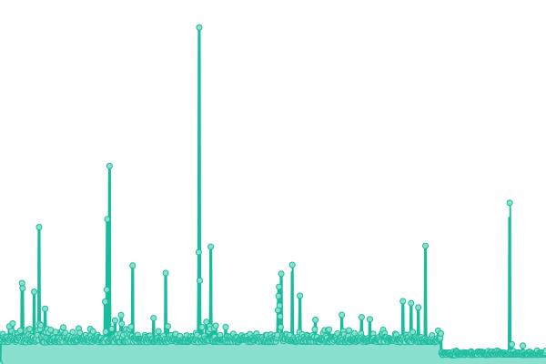

# [📈 Live Status](https://upptime.github.io/upptime): <!--live status--> **🟧 Partial outage**

This repository contains the open-source uptime monitor and status page for [Upptime](https://upptime.js.org), powered by [Upptime](https://github.com/upptime/upptime).

With [Upptime](https://upptime.js.org), you can get your own unlimited and free uptime monitor and status page, powered entirely by a GitHub repository. We use [Issues](https://github.com/upptime/upptime/issues) as incident reports, [Actions](https://github.com/Zebrainy/upptime/actions) as uptime monitors, and [Pages](https://upptime.github.io/upptime) for the status page.

<!--start: status pages-->
<!-- This summary is generated by Upptime (https://github.com/upptime/upptime) -->
<!-- Do not edit this manually, your changes will be overwritten -->
<!-- prettier-ignore -->
| URL | Status | History | Response Time | Uptime |
| --- | ------ | ------- | ------------- | ------ |
|  [Game Server (prod)](https://api-nl.skazbuka.org/api/Version) | 🟩 Up | [game-server-prod.yml](https://github.com/Zebrainy/upptime/commits/HEAD/history/game-server-prod.yml) | 

 505ms
     
 | 

<a href="https://Zebrainy.github.io/upptime/history/game-server-prod">100.00%</a>
    

|  [IS server (prod)](https://is-nl.skazbuka.org/) | 🟩 Up | [is-server-prod.yml](https://github.com/Zebrainy/upptime/commits/HEAD/history/is-server-prod.yml) | 

 1060ms
     
 | 

<a href="https://Zebrainy.github.io/upptime/history/is-server-prod">100.00%</a>
    

|  [Game Server Proxy (prod)](https://proxy.zebr-a.com/api/Version) | 🟩 Up | [game-server-proxy-prod.yml](https://github.com/Zebrainy/upptime/commits/HEAD/history/game-server-proxy-prod.yml) | 

 460ms
     
 | 

<a href="https://Zebrainy.github.io/upptime/history/game-server-proxy-prod">0.00%</a>
    

|  [Game Server Proxy (prod ru)](https://proxy-ru.zebr-a.com/api/Version) | 🟩 Up | [game-server-proxy-prod-ru.yml](https://github.com/Zebrainy/upptime/commits/HEAD/history/game-server-proxy-prod-ru.yml) | 

 575ms
     
 | 

<a href="https://Zebrainy.github.io/upptime/history/game-server-proxy-prod-ru">100.00%</a>
    

|  [IS server Proxy (prod)](https://proxy.zebr-a.com/auth/) | 🟩 Up | [is-server-proxy-prod.yml](https://github.com/Zebrainy/upptime/commits/HEAD/history/is-server-proxy-prod.yml) | 

 139ms
     
 | 

<a href="https://Zebrainy.github.io/upptime/history/is-server-proxy-prod">100.00%</a>
    

|  [Web Subs (Firebase)](https://subs.zebrainy.net/) | 🟥 Down | [web-subs-firebase.yml](https://github.com/Zebrainy/upptime/commits/HEAD/history/web-subs-firebase.yml) | 

 0ms
     
 | 

<a href="https://Zebrainy.github.io/upptime/history/web-subs-firebase">99.36%</a>
    

|  [Latest versions (prod)](https://prod.zebr-a.com/latest/config) | 🟩 Up | [latest-versions-prod.yml](https://github.com/Zebrainy/upptime/commits/HEAD/history/latest-versions-prod.yml) | 

 903ms
     
 | 

<a href="https://Zebrainy.github.io/upptime/history/latest-versions-prod">100.00%</a>
    

|  [Latest versions (prod ru)](https://prod-ru.zebr-a.com/latest/config) | 🟩 Up | [latest-versions-prod-ru.yml](https://github.com/Zebrainy/upptime/commits/HEAD/history/latest-versions-prod-ru.yml) | 

 1286ms
     
 | 

<a href="https://Zebrainy.github.io/upptime/history/latest-versions-prod-ru">100.00%</a>
    

|  [Latest versions (prod-ru-squidex)](https://prod-ru.zebr-a.com/squidex/cache/6402afa4-b358-4d06-875d-d3fc1f3f78cd) | 🟩 Up | [latest-versions-prod-ru-squidex.yml](https://github.com/Zebrainy/upptime/commits/HEAD/history/latest-versions-prod-ru-squidex.yml) | 

 548ms
     
 | 

<a href="https://Zebrainy.github.io/upptime/history/latest-versions-prod-ru-squidex">100.00%</a>
    

|  [Latest versions (prod-squidex)](https://prod.zebr-a.com/squidex/cache/6402afa4-b358-4d06-875d-d3fc1f3f78cd) | 🟩 Up | [latest-versions-prod-squidex.yml](https://github.com/Zebrainy/upptime/commits/HEAD/history/latest-versions-prod-squidex.yml) | 

 598ms
     
 | 

<a href="https://Zebrainy.github.io/upptime/history/latest-versions-prod-squidex">100.00%</a>
    

|  [Supported client versions (prod-squidex)](https://prod.zebr-a.com/squidex/cache/b6b3b942-77fd-4417-ba91-0879a2c0c5a7) | 🟩 Up | [supported-client-versions-prod-squidex.yml](https://github.com/Zebrainy/upptime/commits/HEAD/history/supported-client-versions-prod-squidex.yml) | 

 476ms
     
 | 

<a href="https://Zebrainy.github.io/upptime/history/supported-client-versions-prod-squidex">0.00%</a>
    

|  [A/B-service config (prod-squidex)](https://prod.zebr-a.com/squidex/cache/63b8e574-6ee8-4bda-bbbb-8cab184f4db9) | 🟩 Up | [a-b-service-config-prod-squidex.yml](https://github.com/Zebrainy/upptime/commits/HEAD/history/a-b-service-config-prod-squidex.yml) | 

 176ms
     
 | 

<a href="https://Zebrainy.github.io/upptime/history/a-b-service-config-prod-squidex">0.00%</a>
    

|  [A/B-service](https://prod.zebr-a.com/ab/abconfig/test_config) | 🟩 Up | [a-b-service.yml](https://github.com/Zebrainy/upptime/commits/HEAD/history/a-b-service.yml) | 

 171ms
     
 | 

<a href="https://Zebrainy.github.io/upptime/history/a-b-service">0.00%</a>
    

|  [A/B-service ru](https://prod-ru.zebr-a.com/ab/abconfig/test_config) | 🟩 Up | [a-b-service-ru.yml](https://github.com/Zebrainy/upptime/commits/HEAD/history/a-b-service-ru.yml) | 

 485ms
     
 | 

<a href="https://Zebrainy.github.io/upptime/history/a-b-service-ru">100.00%</a>
    

|  [Client init service](https://prod.zebr-a.com/client-init-service) | 🟩 Up | [client-init-service.yml](https://github.com/Zebrainy/upptime/commits/HEAD/history/client-init-service.yml) | 

 123ms
     
 | 

<a href="https://Zebrainy.github.io/upptime/history/client-init-service">100.00%</a>
    

|  [Client init service ru](https://prod-ru.zebr-a.com/client-init-service) | 🟩 Up | [client-init-service-ru.yml](https://github.com/Zebrainy/upptime/commits/HEAD/history/client-init-service-ru.yml) | 

 253ms
     
 | 

<a href="https://Zebrainy.github.io/upptime/history/client-init-service-ru">100.00%</a>
    

|  [Web Games DB (prod)](https://prod.zebr-a.com/squidex/cache/dc0acf63-174a-43ab-8dd4-9ee5279aea5b) | 🟩 Up | [web-games-db-prod.yml](https://github.com/Zebrainy/upptime/commits/HEAD/history/web-games-db-prod.yml) | 

 126ms
     
 | 

<a href="https://Zebrainy.github.io/upptime/history/web-games-db-prod">100.00%</a>
    

|  [multilevel-catalog-new-games-paywall (prod)](https://prod.zebr-a.com/squidex/cache/58507d07-0d32-4815-8264-75fa327363d2) | 🟩 Up | [multilevel-catalog-new-games-paywall-prod.yml](https://github.com/Zebrainy/upptime/commits/HEAD/history/multilevel-catalog-new-games-paywall-prod.yml) | 

 560ms
     
 | 

<a href="https://Zebrainy.github.io/upptime/history/multilevel-catalog-new-games-paywall-prod">100.00%</a>
    

|  [(dev) Latest versions](https://prod.zebr-a.com/squidex/cache/b6b3b942-77fd-4417-ba91-0879a2c0c5a7?draft=1) | 🟩 Up | [dev-latest-versions.yml](https://github.com/Zebrainy/upptime/commits/HEAD/history/dev-latest-versions.yml) | 

 132ms
     
 | 

<a href="https://Zebrainy.github.io/upptime/history/dev-latest-versions">100.00%</a>
    

|  [(dev) A/B-service](https://prod.zebr-a.com/squidex/cache/d28bb12d-727e-42a1-a57c-917c8c8a875c) | 🟩 Up | [dev-a-b-service.yml](https://github.com/Zebrainy/upptime/commits/HEAD/history/dev-a-b-service.yml) | 

 679ms
     
 | 

<a href="https://Zebrainy.github.io/upptime/history/dev-a-b-service">100.00%</a>
    

|  [latest 8.5.5](https://prod.zebr-a.com/latest/config/8.5.5) | 🟩 Up | [latest-8-5-5.yml](https://github.com/Zebrainy/upptime/commits/HEAD/history/latest-8-5-5.yml) | 

 183ms
     
 | 

<a href="https://Zebrainy.github.io/upptime/history/latest-8-5-5">100.00%</a>
    

|  [latest 8.5.6](https://prod.zebr-a.com/latest/config/8.5.6) | 🟩 Up | [latest-8-5-6.yml](https://github.com/Zebrainy/upptime/commits/HEAD/history/latest-8-5-6.yml) | 

 169ms
     
 | 

<a href="https://Zebrainy.github.io/upptime/history/latest-8-5-6">100.00%</a>
    

|  [latest 8.5.5 ru](https://prod-ru.zebr-a.com/latest/config/8.5.5) | 🟩 Up | [latest-8-5-5-ru.yml](https://github.com/Zebrainy/upptime/commits/HEAD/history/latest-8-5-5-ru.yml) | 

 302ms
     
 | 

<a href="https://Zebrainy.github.io/upptime/history/latest-8-5-5-ru">100.00%</a>
    

|  [Game Server Stripe Billing (prod)](https://api.skazbuka.org/api/Billing/stripe?language=Rus) | 🟩 Up | [game-server-stripe-billing-prod.yml](https://github.com/Zebrainy/upptime/commits/HEAD/history/game-server-stripe-billing-prod.yml) | 

 1365ms
     
 | 

<a href="https://Zebrainy.github.io/upptime/history/game-server-stripe-billing-prod">100.00%</a>
    

|  [Selectel CDN](https://6a39d29f-7919-4a2c-b54e-f8066f9effbb.selcdn.net/) | 🟥 Down | [selectel-cdn.yml](https://github.com/Zebrainy/upptime/commits/HEAD/history/selectel-cdn.yml) | 

 1507ms
     
 | 

<a href="https://Zebrainy.github.io/upptime/history/selectel-cdn">0.00%</a>
    

|  [Cloudflare WebBundle CDN](https://cdn.zebr-a.tech/web-bundles/bundles/catalog-demian-horizontal/1.0.0/manifest.json) | 🟩 Up | [cloudflare-web-bundle-cdn.yml](https://github.com/Zebrainy/upptime/commits/HEAD/history/cloudflare-web-bundle-cdn.yml) | 

 646ms
     
 | 

<a href="https://Zebrainy.github.io/upptime/history/cloudflare-web-bundle-cdn">100.00%</a>
    

|  [Cloudflare Internal CDN](https://internal.zebr-a.tech/test/empty.json) | 🟩 Up | [cloudflare-internal-cdn.yml](https://github.com/Zebrainy/upptime/commits/HEAD/history/cloudflare-internal-cdn.yml) | 

 656ms
     
 | 

<a href="https://Zebrainy.github.io/upptime/history/cloudflare-internal-cdn">100.00%</a>
    

<!--end: status pages-->

[**Visit our status website →**](https://upptime.github.io/upptime)

## 📄 License

- Powered by: [Upptime](https://github.com/upptime/upptime)
- Code: [MIT](./LICENSE) © [Upptime](https://upptime.js.org)
- Data in the `./history` directory: [Open Database License](https://opendatacommons.org/licenses/odbl/1-0/)
