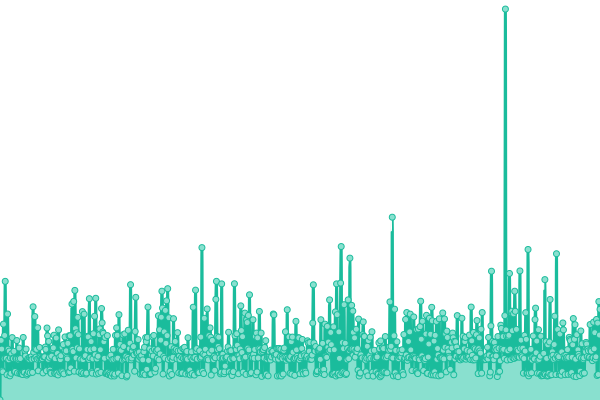
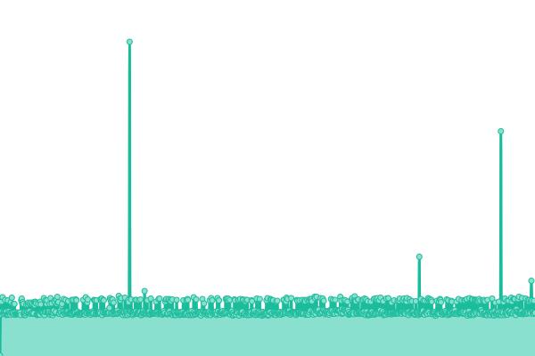
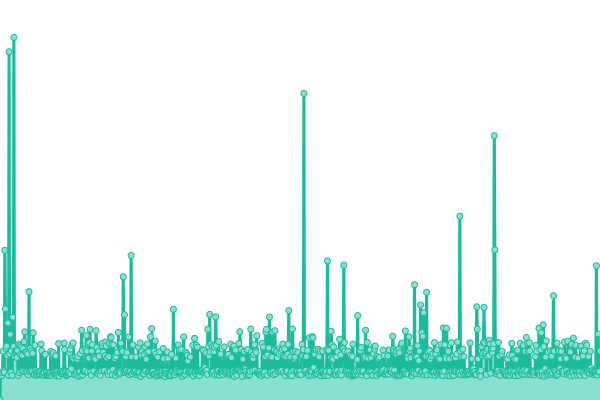
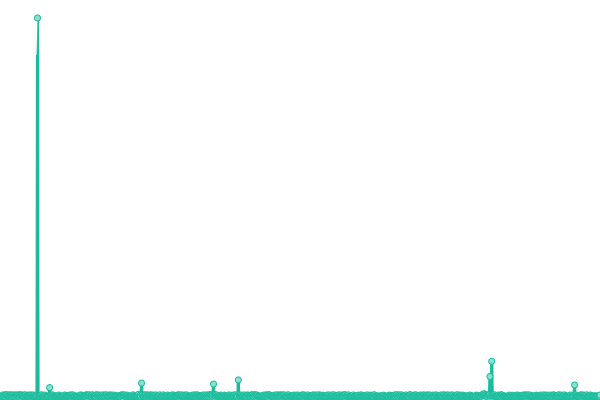

# [📈 Live Status](https://upptime.github.io/upptime): <!--live status--> **🟧 Partial outage**

This repository contains the open-source uptime monitor and status page for [Upptime](https://upptime.js.org), powered by [Upptime](https://github.com/upptime/upptime).

With [Upptime](https://upptime.js.org), you can get your own unlimited and free uptime monitor and status page, powered entirely by a GitHub repository. We use [Issues](https://github.com/upptime/upptime/issues) as incident reports, [Actions](https://github.com/Zebrainy/upptime/actions) as uptime monitors, and [Pages](https://upptime.github.io/upptime) for the status page.

<!--start: status pages-->
<!-- This summary is generated by Upptime (https://github.com/upptime/upptime) -->
<!-- Do not edit this manually, your changes will be overwritten -->
<!-- prettier-ignore -->
| URL | Status | History | Response Time | Uptime |
| --- | ------ | ------- | ------------- | ------ |
|  [Game Server (prod)](https://api.skazbuka.org/api/Version) | 🟩 Up | [game-server-prod.yml](https://github.com/Zebrainy/upptime/commits/HEAD/history/game-server-prod.yml) | 

 365ms
     
 | 

<a href="https://Zebrainy.github.io/upptime/history/game-server-prod">100.00%</a>
    

|  [Firebase URLs (prod)](https://api-7872423500061383086-499814.firebaseio.com/config/urls/v3.json) | 🟩 Up | [firebase-ur-ls-prod.yml](https://github.com/Zebrainy/upptime/commits/HEAD/history/firebase-ur-ls-prod.yml) | 

 169ms
     
 | 

<a href="https://Zebrainy.github.io/upptime/history/firebase-ur-ls-prod">100.00%</a>
    

|  [Latest versions (prod)](https://prod.zebr-a.com/latest/config) | 🟩 Up | [latest-versions-prod.yml](https://github.com/Zebrainy/upptime/commits/HEAD/history/latest-versions-prod.yml) | 

 459ms
     
 | 

<a href="https://Zebrainy.github.io/upptime/history/latest-versions-prod">100.00%</a>
    

|  [Latest versions (prod-squidex)](https://prod.zebr-a.com/squidex/cache/6402afa4-b358-4d06-875d-d3fc1f3f78cd) | 🟩 Up | [latest-versions-prod-squidex.yml](https://github.com/Zebrainy/upptime/commits/HEAD/history/latest-versions-prod-squidex.yml) | 

 103ms
     
 | 

<a href="https://Zebrainy.github.io/upptime/history/latest-versions-prod-squidex">100.00%</a>
    

|  [Supported client versions (prod-squidex)](https://prod.zebr-a.com/squidex/cache/b6b3b942-77fd-4417-ba91-0879a2c0c5a7) | 🟩 Up | [supported-client-versions-prod-squidex.yml](https://github.com/Zebrainy/upptime/commits/HEAD/history/supported-client-versions-prod-squidex.yml) | 

 106ms
     
 | 

<a href="https://Zebrainy.github.io/upptime/history/supported-client-versions-prod-squidex">100.00%</a>
    

|  [A/B-service](https://prod.zebr-a.com/ab/abconfig/test_config) | 🟩 Up | [a-b-service.yml](https://github.com/Zebrainy/upptime/commits/HEAD/history/a-b-service.yml) | 

 366ms
     
 | 

<a href="https://Zebrainy.github.io/upptime/history/a-b-service">100.00%</a>
    

|  [IS server (prod)](https://is.skazbuka.org/) | 🟩 Up | [is-server-prod.yml](https://github.com/Zebrainy/upptime/commits/HEAD/history/is-server-prod.yml) | 

 292ms
     
 | 

<a href="https://Zebrainy.github.io/upptime/history/is-server-prod">100.00%</a>
    

|  [Web Games DB (prod)](https://prod.zebr-a.com/squidex/cache/dc0acf63-174a-43ab-8dd4-9ee5279aea5b) | 🟩 Up | [web-games-db-prod.yml](https://github.com/Zebrainy/upptime/commits/HEAD/history/web-games-db-prod.yml) | 

 103ms
     
 | 

<a href="https://Zebrainy.github.io/upptime/history/web-games-db-prod">100.00%</a>
    

|  [Default catalog config (prod)](https://prod.zebr-a.com/squidex/cache/27c45b39-7ab2-447c-b43c-4da9a2fbd271) | 🟩 Up | [default-catalog-config-prod.yml](https://github.com/Zebrainy/upptime/commits/HEAD/history/default-catalog-config-prod.yml) | 

 201ms
     
 | 

<a href="https://Zebrainy.github.io/upptime/history/default-catalog-config-prod">100.00%</a>
    

|  [40% catalog config (prod)](https://prod.zebr-a.com/squidex/cache/7e9e3f0d-7f40-4df7-a806-f04ae30f16b7) | 🟩 Up | [40-catalog-config-prod.yml](https://github.com/Zebrainy/upptime/commits/HEAD/history/40-catalog-config-prod.yml) | 

 201ms
     
 | 

<a href="https://Zebrainy.github.io/upptime/history/40-catalog-config-prod">100.00%</a>
    

|  [10% catalog config (prod)](https://prod.zebr-a.com/squidex/cache/f8e52246-0c62-4263-b2bd-20d5418884d5) | 🟩 Up | [10-catalog-config-prod.yml](https://github.com/Zebrainy/upptime/commits/HEAD/history/10-catalog-config-prod.yml) | 

 203ms
     
 | 

<a href="https://Zebrainy.github.io/upptime/history/10-catalog-config-prod">100.00%</a>
    

|  [(dev) Latest versions](https://prod.zebr-a.com/squidex/cache/b6b3b942-77fd-4417-ba91-0879a2c0c5a7?draft=1) | 🟩 Up | [dev-latest-versions.yml](https://github.com/Zebrainy/upptime/commits/HEAD/history/dev-latest-versions.yml) | 

 108ms
     
 | 

<a href="https://Zebrainy.github.io/upptime/history/dev-latest-versions">100.00%</a>
    

|  [(dev) A/B-service](http://95.217.78.110:5007/abconfig/test_config) | 🟩 Up | [dev-a-b-service.yml](https://github.com/Zebrainy/upptime/commits/HEAD/history/dev-a-b-service.yml) | 

 1183ms
     
 | 

<a href="https://Zebrainy.github.io/upptime/history/dev-a-b-service">100.00%</a>
    

|  [(regression) latest dev 7.7.6](https://prod.zebr-a.com/latest/config/7.7.6/?dev=1) | 🟥 Down | [regression-latest-dev-7-7-6.yml](https://github.com/Zebrainy/upptime/commits/HEAD/history/regression-latest-dev-7-7-6.yml) | 

 0ms
     
 | 

<a href="https://Zebrainy.github.io/upptime/history/regression-latest-dev-7-7-6">82.69%</a>
    

<!--end: status pages-->

[**Visit our status website →**](https://upptime.github.io/upptime)

## 📄 License

- Powered by: [Upptime](https://github.com/upptime/upptime)
- Code: [MIT](./LICENSE) © [Upptime](https://upptime.js.org)
- Data in the `./history` directory: [Open Database License](https://opendatacommons.org/licenses/odbl/1-0/)
