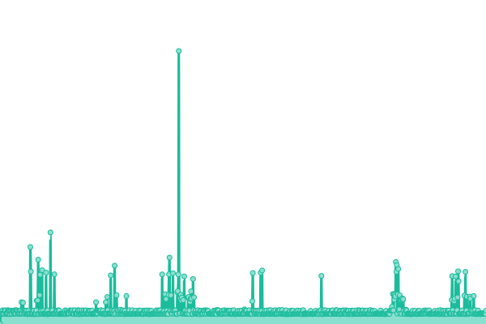
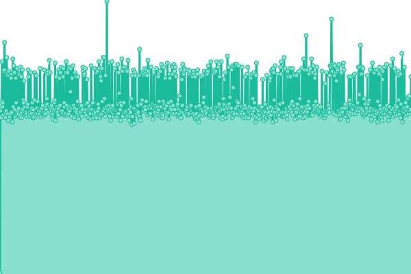

# [📈 Live Status](https://upptime.github.io/upptime): <!--live status--> **🟩 All systems operational**

This repository contains the open-source uptime monitor and status page for [Upptime](https://upptime.js.org), powered by [Upptime](https://github.com/upptime/upptime).

With [Upptime](https://upptime.js.org), you can get your own unlimited and free uptime monitor and status page, powered entirely by a GitHub repository. We use [Issues](https://github.com/upptime/upptime/issues) as incident reports, [Actions](https://github.com/upptime/upptime/actions) as uptime monitors, and [Pages](https://upptime.github.io/upptime) for the status page.

<!--start: status pages-->
<!-- This summary is generated by Upptime (https://github.com/upptime/upptime) -->
<!-- Do not edit this manually, your changes will be overwritten -->
<!-- prettier-ignore -->
| URL | Status | History | Response Time | Uptime |
| --- | ------ | ------- | ------------- | ------ |
|  [Latest versions (prod)](https://prod.zebr-a.com/latest/config) | 🟩 Up | [latest-versions-prod.yml](https://github.com/Zebrainy/upptime/commits/HEAD/history/latest-versions-prod.yml) | 

 436ms
     
 | 

<a href="https://upptime.github.io/upptime/history/latest-versions-prod">100.00%</a>
    

|  [Latest versions (prod-squidex)](https://prod.zebr-a.com/squidex/cache/b6b3b942-77fd-4417-ba91-0879a2c0c5a7) | 🟩 Up | [latest-versions-prod-squidex.yml](https://github.com/Zebrainy/upptime/commits/HEAD/history/latest-versions-prod-squidex.yml) | 

 95ms
     
 | 

<a href="https://upptime.github.io/upptime/history/latest-versions-prod-squidex">100.00%</a>
    

|  [(dev) Latest versions](https://prod.zebr-a.com/squidex/cache/b6b3b942-77fd-4417-ba91-0879a2c0c5a7?draft=1) | 🟩 Up | [dev-latest-versions.yml](https://github.com/Zebrainy/upptime/commits/HEAD/history/dev-latest-versions.yml) | 

 243ms
     
 | 

<a href="https://upptime.github.io/upptime/history/dev-latest-versions">100.00%</a>
    

|  [A/B-service](https://prod.zebr-a.com/ab/abconfig/test_config) | 🟩 Up | [a-b-service.yml](https://github.com/Zebrainy/upptime/commits/HEAD/history/a-b-service.yml) | 

 333ms
     
 | 

<a href="https://upptime.github.io/upptime/history/a-b-service">100.00%</a>
    

|  [(dev) A/B-service](http://95.217.78.110:5007/abconfig/test_config) | 🟩 Up | [dev-a-b-service.yml](https://github.com/Zebrainy/upptime/commits/HEAD/history/dev-a-b-service.yml) | 

 895ms
     
 | 

<a href="https://upptime.github.io/upptime/history/dev-a-b-service">100.00%</a>
    

<!--end: status pages-->

[**Visit our status website →**](https://upptime.github.io/upptime)

## 📄 License

- Powered by: [Upptime](https://github.com/upptime/upptime)
- Code: [MIT](./LICENSE) © [Upptime](https://upptime.js.org)
- Data in the `./history` directory: [Open Database License](https://opendatacommons.org/licenses/odbl/1-0/)
